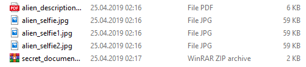
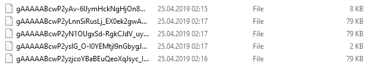

# VirtualSafe

With this program you can easily protect your files by encrypting them using a 32 character key generated by the tool. This tool as well as being able to encrypt and decrypt files can do the same thing on file names, making them unreadable.

## Showcase
Before full encrypt (data encrypt and file name encrypt):


After full encrypt (data encrypt and file name encrypt):


## Prerequisites
This program requires `python3`. It can be downloaded through the [download page]("https://www.python.org/downloads/") on the official python website.

## Setup
For an easy setup you can run `setup.py` file:

``` shell
python setup.py install
```

## Getting Started

### Step 1 - Generate key
As I said before, this program let the user also generate the key (that will be used for encrypt/decrypt files and filenames). It can do that using this command:
``` shell
python virtualsafe.py --generate-key <SAVE_LOCATION> --security-credentials <PASSWORD> <SALT>
```

Command example:
``` shell
python virtualsafe.py --generate-key "C:\Users\luca6\Desktop\super-secure-key.txt" --security-credentials "password" "salt"
```

The parameter of "--generate-key" specify where the key will be saved after the generation, while the parameter of "--security-credentials" are used for generate an unique key. The length of the key it's hard-coded in the program (32 characters) so it can be modified via parameters.

### Step 2 - Crypt directory
After the key it's generated you can already secure your directory via encryption using this simple command:
``` shell
python virtualsafe.py --crypt-dir <DIRECTORY_PATH> <KEY_PATH> 
``` 

Command example:
``` shell
python virtualsafe.py --crypt-dir "C:\Users\luca6\Desktop\super_secret_directory" "C:\Users\luca6\Desktop\super-secure-key.txt" 
``` 

The parameters of "--crypt-dir" specify what's the directory to be secured and where is the key that will be used for the data encryption.

**WARNING: Mind what directory you encrypt; if you encrypt a folder that is already encrypted all your data will be lost (can't be decrypted). This will fixed in future versions.**

### Step 3 - Decrypt directory
After you have encryted the file's data, them are not accessible. To make the files readable again you have to decypt the data. This using this simple command:
``` shell
python virtualsafe.py --decrypt-dir <CRYPTED_DIRECTORY_PATH> <KEY_PATH> 
``` 

Command example:
``` shell
python virtualsafe.py --decrypt-dir "C:\Users\luca6\Desktop\super_secret_directory" "C:\Users\luca6\Desktop\super-secure-key.txt" 
``` 

**WANING: Mind what key you use for the decryption; if you use a different key to decrypt from the one you used during encryption your data will be lost. This due to security purpouses.**

### Extra - Crypt/Decrypt file names
This is an extra features which allows you to hide file data and also their file names. This feature is only a flag so it doesn't have a dedicated command.

For encrypt the file names you have to add the flag `crypt-filename` after the `crypt-dir` command:
``` shell
python virtualsafe.py --crypt-dir <DIRECTORY_PATH> <KEY_PATH> --crypt-filename
``` 

Command example:
``` shell
python virtualsafe.py --crypt-dir "C:\Users\luca6\Desktop\super_secret_directory" "C:\Users\luca6\Desktop\super-secure-key.txt" --crypt-filename 
``` 

Otherwise for decrypt the file names you have to add the flag `decrypt-filename` after the `decrypt-dir` command:

Command example:
``` shell
python virtualsafe.py --decrypt-dir "C:\Users\luca6\Desktop\super_secret_directory" "C:\Users\luca6\Desktop\super-secure-key.txt" --decrypt-filename
``` 
